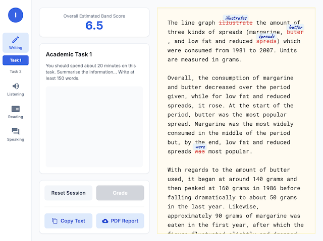
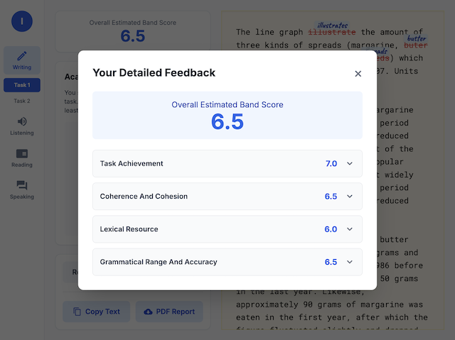
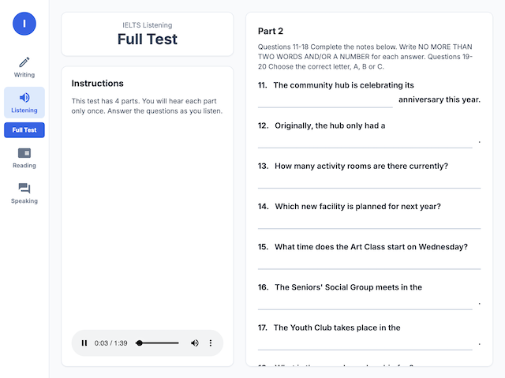

# IELTS Simulator

> AI-powered IELTS practice platform with timed sessions, grading, error annotations, and PDF reports.


## Screenshots





## Live Demo

🔗 **[Try it live](https://raulito1500.github.io/ielts-simulator)**

## Modules

| Section | Status |
|---------|--------|
| Writing — Task 1 | ✅ Live |
| Writing — Task 2 | ✅ Live |
| Listening — Full Test | ✅ Live |
| Reading — Passages 1, 2 & 3 | 🚧 In development |
| Speaking — Parts 1, 2 & 3 | 🚧 In development |

## Writing Task 1 — Features

- Random task generation (charts, graphs, tables) via **Gemini 2.0 Flash**
- 20-minute timed writing session with countdown (red alert at &lt;5 min)
- AI grading across 4 official IELTS criteria — **Gemini 2.5 Flash**
- Handwritten-style error annotations in the corrected essay
- Downloadable PDF report with scores, task image, and full corrections
- Band score 0–9 display per criterion + overall score

## Tech Stack

| Layer | Tech |
|-------|------|
| Framework | React 19 |
| Styling | Tailwind CSS 3 |
| AI Grading | Google Gemini 2.5 Flash |
| Image Generation | Google Gemini 2.0 Flash |
| Audio Generation | Google Gemini 2.5 Flash TTS |
| PDF Export | jsPDF + html2canvas |
| Deployment | GitHub Pages |

## Getting Started

```bash
git clone https://github.com/raulito1500/ielts-simulator.git
cd ielts-simulator
npm install
cp .env.example .env   # then add your API key
npm start
```

## API Keys

This app requires a **Google AI Studio** API key for grading, image generation, and audio generation.

1. Go to [Google AI Studio](https://aistudio.google.com/) and create an API key.
2. Add it to your `.env` file:

```
REACT_APP_GEMINI_API_KEY=your_key_here
```

> **Free tier note:** Writing Task 1 and Task 2 grading work fully on the free tier. The Listening module uses `gemini-2.5-flash-preview-tts` for audio generation, which may be subject to stricter quota limits on free-tier keys. If audio generation fails, check your quota at [Google AI Studio](https://aistudio.google.com/).

## How It Works

### Writing Task 1

1. Click **Generate Random Graph Task** — a random IELTS Writing Task 1 prompt (chart, graph, or table) is created via AI.
2. Write your response in the timed sheet — you have **20 minutes**.
3. When time runs out, click **Grade** — receive band scores and inline corrections from Gemini.
4. Click **Download PDF** — get a full report with scores, task image, and annotated essay.

### Writing Task 2

1. Click **Generate Task** — a random IELTS Writing Task 2 essay question is generated.
2. Write your response — you have **40 minutes**.
3. When time runs out, click **Grade** — receive band scores and inline corrections from Gemini.
4. Click **Download PDF** — get a full report with your score and annotated essay.

### Listening Full Test

1. Click **Start Test** — Gemini generates the questions and audio script for Part 1.
2. **Pre-reading phase (60 sec)** — Read the questions before the recording starts.
3. **Audio plays** — the listening track is generated by Gemini TTS with realistic single or multi-speaker voices.
4. **Answer review (60 sec)** — Check or adjust your answers after the recording ends.
5. The test advances automatically through all 4 parts, repeating steps 2–4 for each.
6. After Part 4, click **Finish** — your score out of 40 is shown with the correct answers revealed.

## License

MIT
