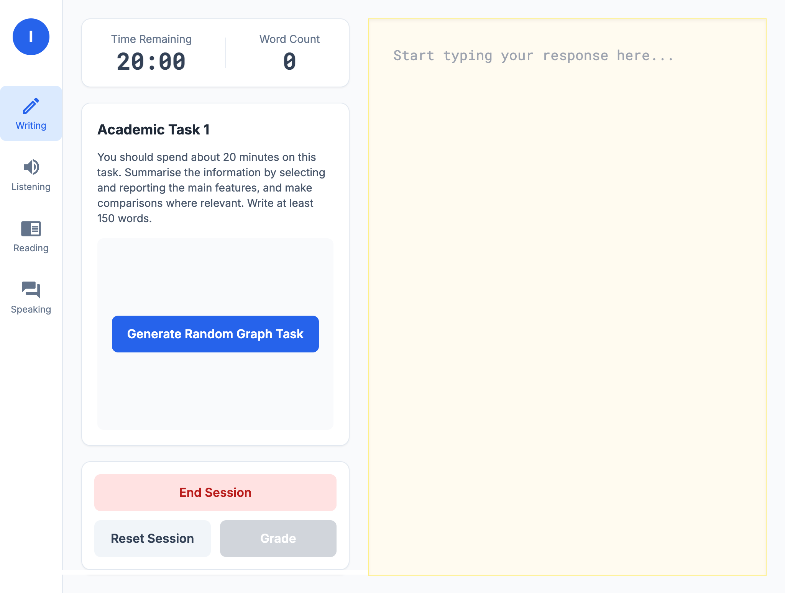

# IELTS Simulator

> AI-powered IELTS practice platform with timed sessions, grading, error annotations, and PDF reports.


## Live Demo

🔗 **[Try it live](https://raulito1500.github.io/ielts-simulator)**

## Screenshots

<!-- Add screenshots here once captured:

-->

## Modules

| Section | Status |
|---------|--------|
| Writing — Task 1 | ✅ Live |
| Writing — Task 2 | 🚧 In development |
| Listening — Full Test | 🚧 In development |
| Reading — Passages 1, 2 & 3 | 🚧 In development |
| Speaking — Parts 1, 2 & 3 | 🚧 In development |

## Writing Task 1 — Features

- Random task generation (charts, graphs, tables) via **Google Imagen 3.0**
- 20-minute timed writing session with countdown (red alert at &lt;5 min)
- AI grading across 4 official IELTS criteria — **Gemini 2.5 Flash**
- Handwritten-style error annotations in the corrected essay
- Downloadable PDF report with scores, task image, and full corrections
- Band score 0–9 display per criterion + overall score

## Tech Stack

| Layer | Tech |
|-------|------|
| Framework | React 19 |
| Styling | Tailwind CSS 3 |
| AI Grading | Google Gemini 2.5 Flash |
| Image Generation | Google Imagen 3.0 |
| PDF Export | jsPDF + html2canvas |
| Deployment | GitHub Pages |

## Getting Started

```bash
git clone https://github.com/raulito1500/ielts-simulator.git
cd ielts-simulator
npm install
cp .env.example .env   # then add your API key
npm start
```

## API Keys

This app requires a **Google AI Studio** API key for both grading and task image generation.

1. Go to [Google AI Studio](https://aistudio.google.com/) and create an API key.
2. Add it to your `.env` file:

```
REACT_APP_GEMINI_API_KEY=your_key_here
```

## How It Works

1. Click **Generate Task** — a random IELTS Writing Task 1 prompt (chart, graph, or table) is created via AI
2. Write your response in the timed sheet — you have **20 minutes**
3. When time runs out, click **Grade** — receive band scores and inline corrections from Gemini
4. Click **Download PDF** — get a full report with scores, task image, and annotated essay

## License

MIT
